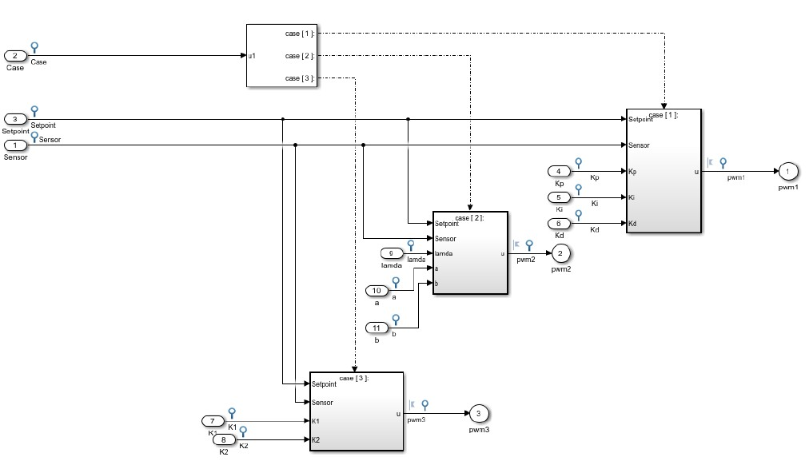

## Embeded Control System Course Final Project
Included PID, STR, LQR controller running on a MicroController aim for controlling DC motor's position

## MATLAB SIMULINK

STR 


Identify for STR control


## Firmware

Add libraries from MATLAB to build the library generated from the Simulink file.
```
Includes
├── MATLAB/R2023a/extern/include
├── MATLAB/R2023a/rtw/c/ert
├── MATLAB/R2023a/rtw/c/src
├── MATLAB/R2023a/rtw/c/src/ext_mode/common
└── MATLAB/R2023a/simulink/include
```
```
Core
├── Inc
│   ├── main.h
│   ├── stm32f4xx_hal_conf.h
│   ├── stm32f4xx_it.h
│   └── user_define.h
├── Matlab (C library build from MATLAB Simulink model)
└── Src
    ├── main.c
    ├── stm32f4xx_hal_msp.c
    ├── stm32f4xx_it.c
    ├── syscalls.c
    ├── sysmem.c
    └── system_stm32f4xx.c
```
## Software 
GUI build with Visual Studio (C#)

